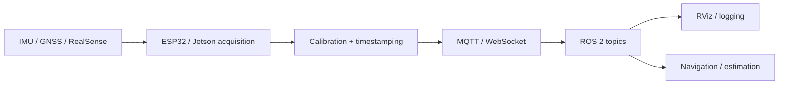

# SenDiMoniProg — Embedded Sensing & ROS 2 Navigation Infrastructure

<p align="center">
  <strong>IMU · GNSS · Intel RealSense · ROS 2 · Jetson-class computing · ESP32 · MQTT / WebSocket transport · field testing</strong>
</p>

<p align="center">
  
  
</p>

## Overview

SenDiMoniProg is an embedded sensing and robotics-integration stack developed around distributed acquisition, transport, and ROS 2 interfaces for navigation experiments. The system brings IMU, GNSS, and Intel RealSense measurements from embedded hardware into a workstation environment while preserving the timing, calibration, and frame information required by downstream estimation algorithms.

The end-to-end path is

```text
IMU / GNSS / RealSense
→ embedded acquisition
→ calibration and timestamping
→ MQTT / WebSocket transport
→ ROS 2 interfaces
→ visualization and logging
→ navigation / state-estimation consumers
```

The repository focuses on the sensing and communication infrastructure itself: acquiring measurements reliably, transporting them across heterogeneous devices, reconstructing ROS 2 interfaces, and making the resulting data suitable for repeatable navigation experiments.

---

## 1. System architecture



This separation is useful experimentally because transport performance can be characterized independently from estimator performance.

---

## 2. IMU measurement model

A standard gyroscope model is

```math
\omega_m=\omega+b_g+n_g.
```

For the accelerometer,

```math
a_m=R^T(a-g)+b_a+n_a.
```

where `b_g` and `b_a` denote sensor biases, `n_g` and `n_a` measurement noise, and `R` the selected frame transformation.

These terms motivate several implementation choices in the repository: sensor calibration is stored explicitly, timestamps are preserved as close to acquisition as possible, and coordinate frames are treated as part of the measurement definition rather than as visualization metadata.

---

## 3. Distributed transport

### 3.1 IMU WebSocket bridge

The IMU bridge separates the embedded ROS graph from the workstation:

```text
IMU hardware
→ ROS 2 /imu/data on the embedded computer
→ imu_ws_server
→ WebSocket transport
→ imu_ws_client on the workstation
→ reconstructed ROS 2 /imu/data
→ RViz / logger / estimator
```

This is particularly useful when direct DDS discovery across network boundaries is unreliable or when a controlled application-layer transport is preferred.

### 3.2 RealSense transport

The RealSense path sends image/depth matrices together with the metadata needed to reconstruct each frame consistently.

| Topic | Content |
|---|---|
| `cam/jetson01/color_mat` | BGR8 color matrix |
| `cam/jetson01/depth_mat` | Z16 depth matrix |
| `cam/jetson01/meta` | sequence, capture time, FPS, intrinsics |
| `cam/jetson01/calib` | intrinsics and depth scale |
| `cam/jetson01/status` | sensor/runtime status |
| `imu/jetson01/raw` | inertial stream |
| `cam/jetson01/control` | runtime control payload |

A representative binary frame contains

```text
magic       4 bytes   RSF1
kind        uint8     color / depth
seq         uint32
t_cap_ns    uint64
w, h        uint16
channels    uint8
dtype_code  uint8
payload_len uint32
payload     raw contiguous bytes
```

---

## 4. Timing and latency

For a sample captured at `t_cap` and received at `t_rx`, the measured end-to-end latency is

```math
t_{e2e}=t_{rx}-t_{cap}.
```

In the tested ESP32 → Jetson → server configuration, the transport path was reduced from **92 ms to 6 ms** after changes to the networking and telemetry pipeline.

The result belongs to that specific hardware and network configuration; it is included as a systems-integration result rather than as a general ROS 2 latency benchmark.

---

## 5. Depth sensing and point-cloud pipeline

<p align="center">
  
  
</p>

The depth pipeline verifies the complete path from camera acquisition to reconstructed visualization, including the calibration metadata needed to interpret depth values.

### Operational demonstration

<p align="center">
  <a href="https://raw.githubusercontent.com/kosmicplane/kosmicplane.github.io/main/assets/media/projects/ncu-depth-pointcloud.mp4">
    
  </a>
</p>

---

## 6. ROS 2 integration

<p align="center">
  <a href="https://raw.githubusercontent.com/kosmicplane/kosmicplane.github.io/main/assets/media/projects/ncu-rviz-demo.mp4">
    
  </a>
</p>

The RViz sequence shows the reconstructed ROS 2 data path after acquisition and network transport.

---

## 7. Embedded hardware

<p align="center">
  
  
</p>

The experimental stack combines Jetson-class computing, ESP32-based acquisition/telemetry, inertial sensing, GNSS-oriented interfaces, and RealSense depth sensing.

---

## 8. Interface to state estimation

The sensing layer is designed to support estimators such as EKF/UKF pipelines and VIO/SLAM systems. A generic nonlinear estimator operates on

```math
x_{k+1}=f(x_k,u_k)+w_k
```

and

```math
z_k=h(x_k)+v_k.
```

For those equations to be meaningful in practice, the measurement `z_k` must arrive with a coherent timestamp, reference frame, calibration state, and covariance interpretation. That interface discipline is the main role of this repository.

Estimator accuracy is evaluated separately from transport accuracy because the two depend on different assumptions and ground-truth requirements.

---

## 9. Repository map

```text
Sensors/
├── IMU/
├── Camera_RS/
└── RTK_GNSS/

Bridge/
├── MQTT/
└── test_imu_ws_client.py

ROS2/            ROS 2 packages and workspace material
Docker/          reproducible runtime environments
Oriented_Tests/  field / scenario-specific experiments
Instructive/     setup and bridge documentation
```

---

## 10. Running the IMU bridge

### Embedded-side server

```bash
cd /home/SenDiMoniProg-IMU/ROS2/ROS2_PACKAGES
colcon build --symlink-install --packages-select imu_bt_publisher imu_ws_server
source install/setup.bash

ros2 run imu_bt_publisher imu_publisher
ros2 run imu_ws_server imu_ws_server_node
```

### Workstation client

```bash
cd /home/SenDiMoniProg-IMU/ROS2/ROS2_PACKAGES
colcon build --symlink-install --packages-select imu_ws_client
source install/setup.bash

ros2 run imu_ws_client imu_ws_client_node --ros-args \
  -p ws_url:=ws://<JETSON_IP_OR_VPN>:8765
```

---

## 11. Running the RealSense path

```bash
export MQTT_HOST=<BROKER_IP>
export MQTT_PORT=1883
python3 MQTT/Mosquitto_RealSense_Camara.py
```

Viewer:

```bash
python3 MQTT/qt_viewer_app.py
```

Synthetic test mode:

```bash
DEMO_MODE=1 python3 MQTT/qt_viewer_app.py
```

---

## Validation scope

The repository directly documents sensor acquisition, metadata handling, network transport, ROS 2 interface reconstruction, embedded integration, and the measured latency of the tested pipeline. Navigation accuracy, VIO/SLAM robustness, and filter consistency require their own estimator-level experiments and ground truth.

See [BRIDGE_INSTRUCTIONS.md](Instructive/BRIDGE_INSTRUCTIONS.md) for the detailed bridge setup.
