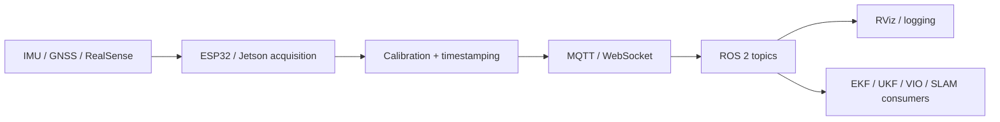

# SenDiMoniProg — Embedded Sensing & ROS 2 Navigation Infrastructure

<p align="center">
  <strong>IMU · GNSS · Intel RealSense · ROS 2 · Jetson-class computing · ESP32 · MQTT / WebSocket transport · field testing</strong>
</p>

<p align="center">
  
  
</p>

## Project objective

SenDiMoniProg is an embedded sensing and robotics-integration stack for transporting synchronized sensor measurements from distributed hardware into a ROS 2 environment suitable for navigation, visualization, logging, and downstream state estimation.

The engineering problem is broader than publishing a ROS topic. The pipeline must preserve:

- acquisition timestamps;
- frame conventions;
- calibration parameters;
- sensor provenance;
- network latency;
- message freshness;
- reproducible launch and logging behavior.

The implemented path is

```text
IMU / GNSS / RealSense
→ embedded acquisition
→ calibration and timestamping
→ MQTT / WebSocket transport
→ ROS 2 interfaces
→ visualization / logging
→ navigation and estimation consumers
```

---

## 1. System architecture



The transport layer and estimator layer are deliberately separated. Reliable sensor delivery is necessary for navigation, but it is not itself proof of estimator accuracy.

---

## 2. IMU measurement model

A standard gyroscope model is

```math
\omega_m
=
\omega
+
b_g
+
n_g.
```

A standard accelerometer model is

```math
a_m
=
R^T(a-g)
+
b_a
+
n_a.
```

where:

- `b_g` and `b_a` are sensor biases;
- `n_g` and `n_a` represent measurement noise;
- `R` is the selected frame transformation;
- `g` is the gravity vector in the corresponding reference convention.

The model makes timestamping, calibration, and coordinate frames part of the measurement definition rather than post-processing details.

---

## 3. Distributed transport architecture

### 3.1 IMU WebSocket bridge

```text
IMU hardware
→ ROS 2 /imu/data on embedded computer
→ imu_ws_server
→ WebSocket transport
→ imu_ws_client on workstation
→ reconstructed ROS 2 /imu/data
→ RViz / logger / estimator
```

This bridge is useful when DDS discovery is unreliable across network boundaries or when a controlled application-layer transport is required.

### 3.2 RealSense path

The camera/depth pipeline transports image matrices together with metadata required for deterministic reconstruction.

| Topic | Payload |
|---|---|
| `cam/jetson01/color_mat` | BGR8 color matrix |
| `cam/jetson01/depth_mat` | Z16 depth matrix |
| `cam/jetson01/meta` | sequence, capture time, FPS, intrinsics |
| `cam/jetson01/calib` | calibration parameters and depth scale |
| `cam/jetson01/status` | sensor/runtime status |
| `imu/jetson01/raw` | inertial stream |
| `cam/jetson01/control` | runtime control payload |

Representative binary framing:

```text
magic       4 bytes   RSF1
kind        uint8     color / depth
seq         uint32
t_cap_ns    uint64
w, h        uint16
channels    uint8
dtype_code  uint8
payload_len uint32
payload     raw contiguous bytes
```

---

## 4. Timing and latency

For a sample captured at time `t_cap` and received at `t_rx`, the end-to-end latency is

```math
t_{\mathrm{e2e}}
=
t_{\mathrm{rx}}
-
t_{\mathrm{cap}}.
```

The tested ESP32 → Jetson → server path was reduced from **92 ms to 6 ms** after transport and networking optimization.

That value is specific to the tested hardware/network configuration; it should not be interpreted as a universal ROS 2 benchmark.

<p align="center">
  
  
  
</p>

These plots document the network path rather than estimator performance.

---

## 5. Depth sensing and point-cloud pipeline

<p align="center">
  
  
</p>

The depth pipeline verifies that camera/depth data can be acquired, transported, reconstructed, and visualized with the associated calibration metadata.

### Operational video

<p align="center">
  <a href="https://raw.githubusercontent.com/kosmicplane/kosmicplane.github.io/main/assets/media/projects/ncu-depth-pointcloud.mp4">
    
  </a>
</p>

---

## 6. ROS 2 integration evidence

<p align="center">
  <a href="https://raw.githubusercontent.com/kosmicplane/kosmicplane.github.io/main/assets/media/projects/ncu-rviz-demo.mp4">
    
  </a>
</p>

This demonstration verifies the sensor-to-ROS visualization path after network transport and topic reconstruction.

---

## 7. Hardware integration

<p align="center">
  
  
</p>

The hardware layer includes Jetson-class processing, ESP32-based acquisition/telemetry, inertial sensing, GNSS-oriented integration, and RealSense sensing.

---

## 8. Downstream state estimation

The repository interfaces are designed to support multi-sensor estimators such as EKF/UKF pipelines and VIO/SLAM fallbacks.

For a generic nonlinear process model,

```math
x_{k+1}
=
f(x_k,u_k)
+
w_k,
```

and measurement model

```math
z_k
=
h(x_k)
+
v_k,
```

the transport layer must provide temporally meaningful `z_k` measurements with known frame and covariance semantics.

Estimator performance must be validated separately from transport performance.

---

## 9. Repository map

```text
Sensors/
├── IMU/
├── Camera_RS/
└── RTK_GNSS/

Bridge/
├── MQTT/
└── test_imu_ws_client.py

ROS2/            ROS 2 packages and workspace material
Docker/          reproducible runtime environments
Oriented_Tests/  field / scenario-specific experiments
Instructive/     setup and bridge documentation
```

---

## 10. Running the IMU bridge

### Embedded-side server

```bash
cd /home/SenDiMoniProg-IMU/ROS2/ROS2_PACKAGES
colcon build --symlink-install --packages-select imu_bt_publisher imu_ws_server
source install/setup.bash

ros2 run imu_bt_publisher imu_publisher
ros2 run imu_ws_server imu_ws_server_node
```

### Workstation client

```bash
cd /home/SenDiMoniProg-IMU/ROS2/ROS2_PACKAGES
colcon build --symlink-install --packages-select imu_ws_client
source install/setup.bash

ros2 run imu_ws_client imu_ws_client_node --ros-args \
  -p ws_url:=ws://<JETSON_IP_OR_VPN>:8765
```

---

## 11. Running the RealSense MQTT path

```bash
export MQTT_HOST=<BROKER_IP>
export MQTT_PORT=1883
python3 MQTT/Mosquitto_RealSense_Camara.py
```

Viewer:

```bash
python3 MQTT/qt_viewer_app.py
```

Synthetic/demo mode:

```bash
DEMO_MODE=1 python3 MQTT/qt_viewer_app.py
```

---

## 12. Validation boundary

The repository directly supports claims about:

- sensor acquisition;
- metadata preservation;
- transport;
- ROS 2 interface reconstruction;
- latency measurements from the tested network path;
- visualization/logging;
- embedded integration.

Claims about navigation accuracy, VIO/SLAM robustness, or EKF/UKF state-estimation quality require the corresponding estimator experiment and ground truth.

See [BRIDGE_INSTRUCTIONS.md](Instructive/BRIDGE_INSTRUCTIONS.md) for bridge setup details.
